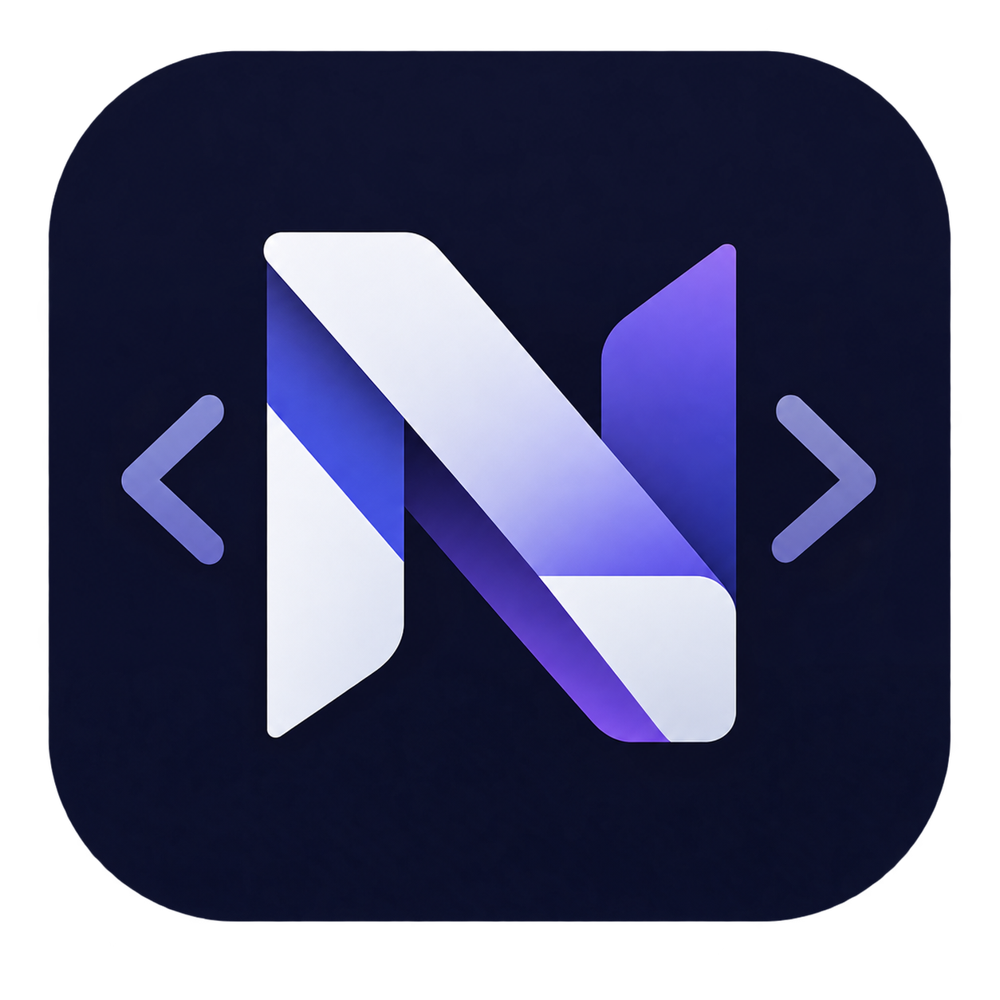

<p align="center">
  
</p>

<h1 align="center">Nexis</h1>

<p align="center">
  Lenguaje de programación moderno, simple y de tipado estático.<br>
  Creado por <strong>BlueNova Studio</strong>.
</p>

<p align="center">
  <a href="docs/README.md"><strong>📚 Documentación</strong></a> ·
  <a href="examples/README.md"><strong>💻 Ejemplos</strong></a> ·
  <a href="releases/README.md"><strong>📦 Releases</strong></a> ·
  <a href="installer/README.md"><strong>🚀 Instalación</strong></a>
</p>

---

## ¿Qué es Nexis?

**Nexis** es un lenguaje de programación diseñado para ser **fácil de aprender** y a la vez **lo suficientemente potente** para proyectos reales. Combina una sintaxis limpia con un tipado estático que ayuda a encontrar errores antes de ejecutar el programa.

```nexis
#/ Hola mundo
Console.print("Hola, Nexis!")

#/ Tipado estático e inferencia
int edad = 18
string nombre = "BlueNova Studio"
auto saludo = "Hola " + nombre   // auto deduce string

#/ Estructuras de control
for i in 1 .. 5 {
    Console.println(fs"{i}: {saludo}")
}
```

## Características principales

| Característica | Descripción |
|---|---|
| **Tipado estático** | Tipos fijos conocidos en tiempo de compilación: `int`, `float`, `double`, `char`, `string`, `bool`. |
| **Inferencia de tipos** | Deducción automática con `auto` y `:=`. |
| **Constantes** | Valores inmutables con `const`. |
| **Estructuras de datos** | `Vector`, `Stack`, `Queue`, `Set`, `Map`, `LinkedList`, `Tree`, `Graph` y `Trie` genéricos. |
| **Control de flujo** | `if/else`, `switch`, `while`, `do while`, `for`, `foreach`. |
| **Funciones** | Con o sin retorno, con `emit ->`, recursión y alcance (scope). |
| **Programación orientada a objetos** | `struct` y `class` para modelar datos. |
| **Manejo de errores** | `try/catch/finally` con errores tipados `NXxx`. |
| **Módulos** | Separación del código en ficheros con `#inject`. |
| **Librería estándar** | `math`, `string`, `random`, `time`, `file`, `network`, `graphics`. |

## Estado del proyecto

| Componente | Estado |
|---|---|
| Documentación oficial | ✅ Publicada (`v0.0.1`) |
| Extensión de VS Code | ✅ Publicada (`v0.0.1`) |
| Compilador | 🚧 En desarrollo |
| Intérprete | 🚧 En desarrollo |
| **Nexis V1.0.0** (producto completo) | ⏳ Pendiente de compilador e intérprete |

> La primera versión general del lenguaje (**Nexis V1.0.0**) se publicará cuando existan el compilador y el intérprete. Consulta el [índice de releases](releases/README.md) para ver las versiones publicadas.

## Comenzar

### 1. Prueba el lenguaje en tu editor

Instala la **extensión de Visual Studio Code** con soporte de sintaxis:

- **VS Code:** abre la paleta de comandos (`Ctrl+Shift+P`) → *Extensions: Install from VSIX...* y selecciona el archivo `nexis-programming-language-support-0.0.1.vsix`.
- O descárgala desde [releases/extension/v0.0.1](releases/extension/v0.0.1/README.md).

> Los instaladores completos del lenguaje estarán disponibles en [installer/](installer/README.md) cuando se publique el compilador y el intérprete.

### 2. Aprende el lenguaje

Sigue la [🕮 documentación oficial](docs/README.md), organizada en orden progresivo:

1. **Fundamentos** — [tipos de datos](docs/language/data-types/README.md), [variables](docs/language/variables/README.md), [operadores](docs/language/operators/README.md) y [comentarios](docs/language/comments/comments.md).
2. **Control de flujo** — [condicionales y bucles](docs/language/control-flow/README.md).
3. **Funciones y módulos** — [funciones](docs/language/functions/README.md) e [importación](docs/language/modules/README.md).
4. **[Estructuras de datos](docs/standard-library/collections/README.md) y [librería estándar](docs/standard-library/librerias/README.md)**.
5. **POO** — [structs y clases](docs/language/poo/README.md).
6. **Errores** — [catálogo completo de errores NX](docs/language/errors/errors.md) y [try/catch](docs/language/errors/try_catch.md).

### 3. Práctica con ejemplos

Revisa los [💻 ejemplos de código](examples/README.md) para ver el lenguaje en acción desde un *hola mundo* hasta módulos y librerías.

## Estructura del repositorio

| Carpeta | Descripción |
|---|---|
| [`docs/`](docs/README.md) | Documentación oficial del lenguaje (fundamentos, librería estándar, POO y errores). |
| [`examples/`](examples/README.md) | Programas de ejemplo listos para probar. |
| [`releases/`](releases/README.md) | Historial de versiones de cada componente y del producto completo. |
| [`installer/`](installer/README.md) | Instaladores del lenguaje. |
| [`img/`](img/) | Recursos gráficos del proyecto. |

## Licencia

Distribuido bajo la **Licencia MIT**. Consulta el archivo [LICENCE](LICENCE) para más detalles.

---

<p align="center">
  Hecho con 💙 por <strong>BlueNova Studio</strong>
</p>